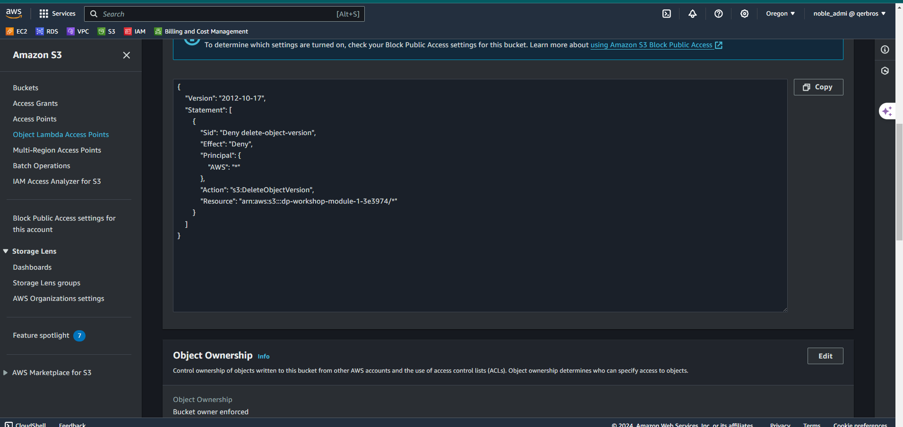

 
 
 
 
 
 ## Extra Credit: Denying delete-object-version


 ``` json
echo '{
    "Version": "2012-10-17",
    "Statement": [
        {
            "Sid": "Deny delete-object-version",
            "Effect": "Deny",
            "Principal": {
                "AWS": "*"
            },
            "Action": "s3:DeleteObjectVersion",
            "Resource": "arn:aws:s3:::'$module1_bucket'/*"
        }
    ]
}' > deny-deleteobjectversion-policy.json

 ```


 

 ### Attached the Polcy to the backet
 The newly created policy was then attached to the bucket *$module1_bucket* which has its actual bucket name as *dp-workshop-module-1-3e3974* as can be seen in the image below which can be found under the permissions tab when the bucket name is clicked on
 

 I then created a new object in the bucket making use of the command
 ```bash
 aws s3api put-object --bucket $module1_bucket --key important-version.txt --body important.txt
 ```
 ### Uploading Files to S3 with AWS CLI

In this step, I used the AWS CLI to upload an important file to my S3 bucket, ensuring it’s stored with a versioned key.

To do this, I used the following command:

```bash
aws s3api put-object --bucket $module1_bucket --key important-version.txt --body important.txt
```
#### What’s Happening Here?

- **Bucket**: Instead of hardcoding the bucket name, I’m using an environment variable `$module1_bucket`, which makes things dynamic and flexible. This variable stores the actual name of my S3 bucket, keeping my setup adaptable to different environments.

- **Key**: The file I’m uploading will be stored under the name `important-version.txt`. Even though the local file is called `important.txt`, I can give it a different name (or key) in S3. This allows me to manage different versions or iterations without overwriting the original files.

- **Body**: The local file `important.txt` is what I’m uploading. It’s a simple text file that I want to store in S3, but S3 allows me to store much more complex data if needed.

By running this command, I was able to securely upload my file to Amazon S3 and easily manage it within the bucket.
