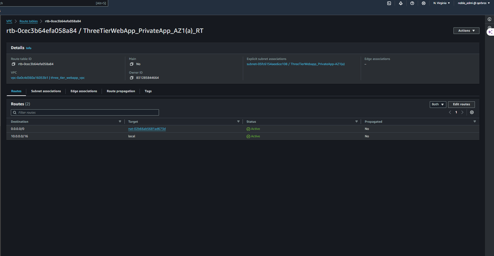
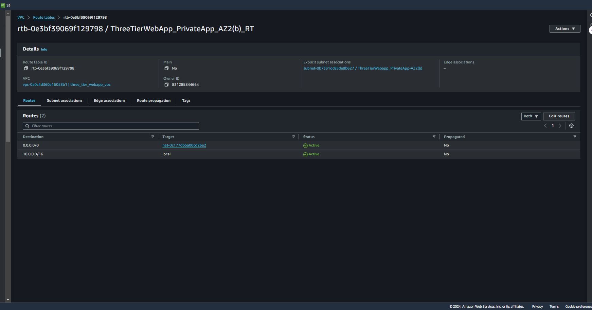
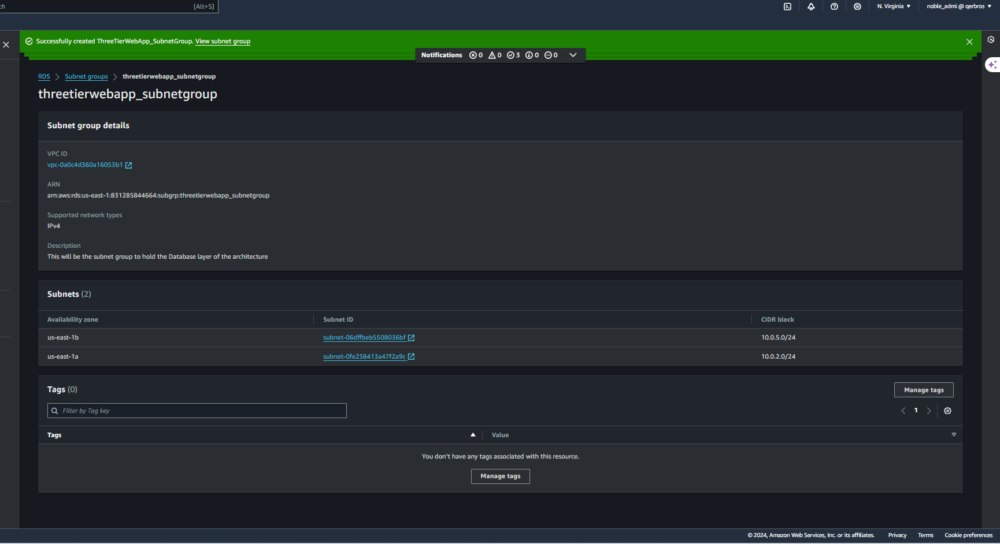
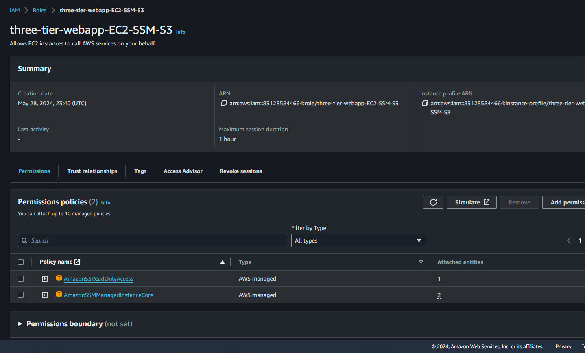
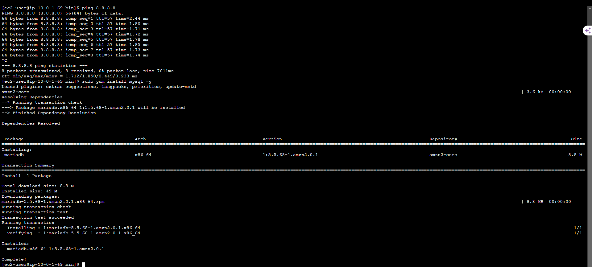
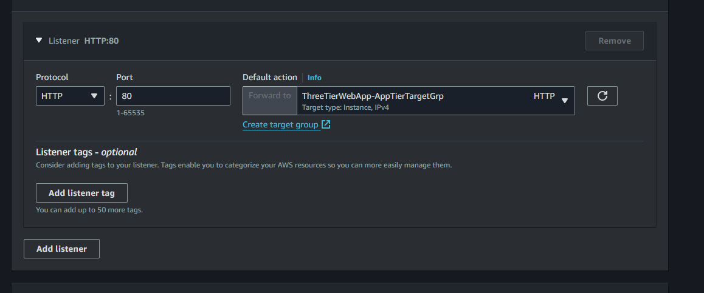

# THREE TIER ARCHITECTURE IMPLEMENTATION ON AWS

The three-tier architecture is a widely adopted software design pattern that divides applications into three distinct layers: the presentation layer, the business logic layer, and the data storage layer. This segmentation facilitates better organization and scalability, particularly in client-server environments like web applications. Each tier performs specific functions and can be managed independently, contrasting with the older monolithic approach where all components were integrated into a single entity.

When it comes to implementing such architectures in the cloud, Amazon Web Services (AWS) stands out as a leading provider offering a plethora of cloud computing services. Some key AWS services essential for building a robust three-tier cloud infrastructure include Elastic Compute Cloud (EC2), Auto Scaling Group, Virtual Private Cloud (VPC), Elastic Load Balancer (ELB), Security Groups, and the Internet Gateway. By leveraging these services, developers can design systems that are highly available and fault-tolerant, ensuring uninterrupted performance even in the face of failures.

In practical terms, utilizing AWS services enables developers to deploy scalable virtual servers (EC2) that automatically adjust to fluctuating demands (Auto Scaling Group). They can also create isolated network environments (VPC) with controlled access and traffic routing (Security Groups, Internet Gateway) while distributing incoming traffic across multiple instances for better performance and reliability (ELB). This approach reflects a paradigm shift towards more resilient and adaptable cloud-based architectures, aligning with modern application development practices.


Architectrual Diagram can be found at 
https://drive.google.com/file/d/12wnWdic_07iAOk1HJWzQ00iMLe-AVaQk/view?usp=sharing

Our goal is to address several key aspects in designing our application infrastructure:

1. Scalability: Each tier of our architecture should be capable of scaling horizontally to accommodate varying levels of traffic and requests. This can be achieved by dynamically adjusting the number of EC2 instances in each tier and load balancing across them. For example, we can add more instances to handle increased demand and scale down during periods of lower traffic automatically.
2. Fault Tolerance: We design our infrastructure to withstand unexpected changes in traffic and faults. This involves implementing redundancy measures, such as maintaining extra EC2 instances to handle increased load without compromising performance. By distributing the workload across multiple instances, we mitigate the impact of failures and ensure uninterrupted service.
3. Security: Our infrastructure prioritizes security by minimizing exposure to external threats. We establish private communication channels within the application, using private IPs and subnet configurations. The presentation tier remains isolated in a private subnet accessible only through an application load balancer, while backend and database tiers are similarly protected from internet access. Additionally, we implement security measures like Bastion hosts for remote SSH access and NAT gateways for internet connectivity within private subnets. AWS security groups further enhance our defenses by restricting access to authorized entities only.
4. High Availability: Unlike traditional data centers that are susceptible to regional disasters, we leverage AWS's multiple availability zones to ensure high availability. By distributing our application across different geographical locations, we minimize the risk of downtime due to localized events like earthquakes or power outages
5. Modularity: We aim to break down our application into separate, manageable components, allowing teams to focus on specific tiers independently. This modular approach ensures agility in making changes and enables quick recovery from unexpected issues by isolating and addressing faulty parts.
In summary, our approach focuses on achieving a well-structured, scalable, highly available, fault-tolerant, and secure infrastructure tailored to meet the demands of modern application environments.

Now that we have gotten introduced to the task at hand, we proceed to execute it.
NB:
Original Project Source as an AWS Workshop that can be found using the link 
https://catalog.us-east-1.prod.workshops.aws/workshops/85cd2bb2-7f79-4e96-bdee-8078e469752a/en-US/introduction
## Project Setup

The setup phase of this workshop involves downloading code from Github, uploading it to an S3 bucket for accessibility by instances, and creating an AWS Identity and Access Management (IAM) EC2 role. This role facilitates secure connections to instances using AWS Systems Manager Session Manager, eliminating the need for SSH key pairs.
This was started by cloning the orinal project from AWS on Github in order to access the project file as can be seen below:


### Creating S3 Bucket
I created a buket by name *three-tier-web-application-bucket* which will serve as a place holder for all the application codes and other important file. In the creation process, all the default were maintained in order to achieve maximum security. The bucket was created in the US East (N. Virginia) us-east-1 region.


### IAM EC2 Instance Role Creation
Role Created name is *three-tier-webapp-EC2-SSM-S3* which has two permissions attached namely
1. AmazonSSMManagedInstanceCore
2. AmazonS3ReadOnlyAccess

The tust relationship created is
```
{
    "Version": "2012-10-17",
    "Statement": [
        {
            "Effect": "Allow",
            "Principal": {
                "Service": "ec2.amazonaws.com"
            },
            "Action": "sts:AssumeRole"
        }
    ]
}
```


### Networking and Security
In this section we will be building out the VPC networking components as well as security groups that will add a layer of protection around our EC2 instances, Aurora databases, and Elastic Load Balancers.

#### VPC Creation

Under this section, i selected VPC only and name it *three_tier_webapp_vpc* iwth CIDR of 10.0.0.0/16
 

#### Creation of Subnets
In this activity as depicted by the Architectural Diagram


#### Adding an Internet Gateway
Though some subnets are named as Public, they are in actual not yet made public to recieve traffic from the internet. This can only be achieved by attaching an Internet Gateway module and configuring the Routes

#### Adding Internet Gateway

Internet Gateway created was calle *ThreeTierWebApp_IGW* which was the only Internet Gatway created in addition to the Default Gateway


The IGW however is currently not associated with any subnet since it is not attached to any VPC and then aattachedment to subnets, hence none of the subnet is currenlty public, ie.e receiving internrt traffic.


#### NAT Gateway Creation

In order for the instances in the app layer private subnet and DB layer Private subnet to be able to access the internet they will need to go through a NAT Gateway. For high availability, we will deploy one NAT gateway in each of your public. In order for the NAT Gatways to have a static IP, I will also create an Elastic IP in the process


The two Gateways are added Successfully with two Elastic IPs (Public Static IPs)


#### Routing Configuration
At this stage, I want to create route table in order to directs traffic in my Infratructure to the right resource. A default route table is already created during the creation of the VPC which aids in establishing Private routing between resources in the Network. This route does not see Public Traffic.

Default Routes can be seen below with its details 


#### Adding of Public Routes

As depicted in the video below,  a public Route Table was created by name ThreTierWebApp_Public_RT with the configuation details below.

The routes were updates to direct all oubic traffic to the Internet Gatway and the subnet that are associated with this routes are 
1. ThreeTierWebapp_PublicWeb-AZ2(b)
2. ThreeTierWebapp_PublicWeb-AZ1(a)


#### Adding of Private Routes

Adding Private Routes will ensure tehe APp Tier does not communicate with the internet Directly but rather through  NAT Gateway. As depicted in the video, Two private routes were created which are 
1. ThreeTierWebApp_PrivateApp_AZ1(a)_RT : This routes traffic to Instances in the availabeility Zone A. The subent associated to this route is ThreeTierWebapp_PrivateApp-AZ1(a) with the routes configured below



2. ThreeTierWebApp_PrivateApp_AZ2(b)_RT : Routes Traffic in Availability Zone B. The subnet assocciated to this route is ThreeTierWebapp_PrivateApp-AZ2(b)



NB: Routes are not added for the DB subnet because the DB is managed Directly by AWS

### Security Groups

Security groups will tighten the rules around which traffic will be allowed to our Elastic Load Balancers and EC2 instances.
The first security group you’ll create is for the public, internet facing load balancer. After typing a name and description, add an inbound rule to allow HTTP type traffic for your IP.

In following security best practices, the security groups are going to be in the from or a daisy chain.

The first security group you’ll create is for the public, internet facing load balancer. After typing a name and description, add an inbound rule to allow HTTP type traffic for your IP.

The second security group you’ll create is for the public instances in the web tier. After typing a name and description, add an inbound rule that allows HTTP type traffic from your internet facing load balancer security group you created in the previous step. This will allow traffic from your public facing load balancer to hit your instances. Then, add an additional rule that will allow HTTP type traffic for your IP. This will allow you to access your instance when we test.

The third security group will be for our internal load balancer. Create this new security group and add an inbound rule that allows HTTP type traffic from your public instance security group. This will allow traffic from your web tier instances to hit your internal load balancer.

The fourth security group we’ll configure is for our private instances. After typing a name and description, add an inbound rule that will allow TCP type traffic on port 4000 from the internal load balancer security group you created in the previous step. This is the port our app tier application is running on and allows our internal load balancer to forward traffic on this port to our private instances. You should also add another route for port 4000 that allows your IP for testing.

The fifth security group we’ll configure protects our private database instances. For this security group, add an inbound rule that will allow traffic from the private instance security group to the MYSQL/Aurora port (3306).


Detailed Explanation can be find the Video below

# My Video

Here is a video embedded directly in the Markdown file:

<iframe src="https://drive.google.com/file/d/1V11c90i-I1qoUKswBaqd0ZmHFr6zm6Qh/preview" width="640" height="480" allow="autoplay"></iframe>


[](https://drive.google.com/file/d/1V11c90i-I1qoUKswBaqd0ZmHFr6zm6Qh/view?usp=drive_link)


## Database Deployment

In the RDS Dashboard, the first thing to be done is the creation of the DB subnet group.



#### Database Deployment
I created the DB with the following details
Database Creations Details

I picked Standard Create and then selected Aurora (MySQL Compatible Version). For the Templates, i went with Dev/Test since this is going to be a Test and not a production workload.
I named the DB Cluster Identifier as ThreeTiierWebApp-Cluster2
For the credentials
Master User is antwinob with Password been 0242.ann
Encryption is een managed by aws/secretesmanager 

In the configuration option, I selected Aurora Standard. IN teh DB instance Class, I selected Memory Optimised Class specifically db.r5.xlarge with 4vCPUs and 32GB RAM, and a Netork of 4750 Mbps
For Multi-AZ deployment, in order to achieve high availability and establish fault tolereance, we went for Multi AZ Deployment.

Under the connectivity option, The ThreeTierWebApp VPC was selected after which the DB Subent group gets populated.The option to access it Publicly has also been turn to No. The secueiry grouo for the DB Tier was selected.

All other options were left in theri default state.


After the creation, the Reader instance was located in the	us-east-1a zoneAZ, whislt the Writer instance	was located in the	us-east-1b zone

The writer Endpoint is *threetiierwebapp-cluster2.cluster-cftuljbvbg8h.us-east-1.rds.amazonaws.com*

whislt that of reader endpoint is *threetiierwebapp-cluster2.cluster-ro-cftuljbvbg8h.us-east-1.rds.amazonaws.com* as indicated in the image below


### App Tier Instance Deployment
In this section, we will create an EC2 instance for our app layer and make all necessary software configurations so that the app can run. The app layer consists of a Node.js application that will run on port 4000. We will also configure our database with some data and tables.

#### App Instance Deployment


In the slection I will create an EC2 instance for our app layer and make all necessary software configurations so that the app can run. The app layer consists of a Node.js application that will run on port 4000. We will also configure our database with some data and tables.

After Opening the EC2 console, 
1. i selected Amazon Linux 2 AMI of  T.2 micro instance type
2. For key pair, i proceeded with a Key pair as the SSM role created will be attached to the VM in order to have access to it on the console directly.
2. Network Settings, I pick the ThreeTiwerWebApp_VPC nd then for the Subnet, since it is an App layer instance, I slected the ThreeTierWebapp_PrivateApp-AZ1(a) subnet. When it comes to the security group, i selected the one created for the app layer as ThreeTierWebApp_AppTier_SG
3. The instance will have na IAM Instance Profile attached. The name for the IAM instance role is *three-tier-webapp-EC2-SSN-S3*
Details of the Role Created are attached below which has two policies



The first Vm of the App layer below


I tested the app instance to ensure it is able to reach the intenet via the NAT Gateway by pinging 8.8.8.8 after i logged into the iinstance using the SSM option


## Configuring The  Database
On the same App instance EC2 console, ti proceeded to download the MySQL CLI uisng the command
```
sudo yum install mysql -y
```


In order to initiate DB connection with your Aurora RDS writer endpoint.

```
mysql -h threetiierwebapp-cluster2.cluster-cftuljbvbg8h.us-east-1.rds.amazonaws.com -u antwinob -p

```


COnnection to the DB has been established after typing in the password


The next thing is to create a tdatabse with which we can interract with. The name of the DB to be created is webappdb which will be created with the command CREATE DATABASE webappdb;   
After the DB was created, a table was also created using the command

``` sql
CREATE TABLE IF NOT EXISTS transactions(id INT NOT NULL
AUTO_INCREMENT, amount DECIMAL(10,2), description
VARCHAR(100), PRIMARY KEY(id));    
```

Data was inserted into the table using the command

```sql
INSERT INTO transactions (amount,description) VALUES ('400','groceries');   

```


### Configure App Instance
The first thing we will do is update our database credentials for the app tier. To do this, open the application-code/app-tier/DbConfig.js file from the github repo in your favorite text editor on your computer. You’ll see empty strings for the hostname, user, password and database. Fill this in with the credentials you configured for your database, the writter endpoint of your database as the hostname, and webappdb for the database. Save the file.
NOTE: This is NOT considered a best practice, and is done for the simplicity of the lab. Moving these credentials to a more suitable place like Secrets Manager is left as an extension for this workshop.


#### Test App Tier


#### Testingin Database Connection


### Internal Load Balancing and Auto Scaling

The first thing to be done is to create an AMI of the first App Tier Instance.


I selected the ThreeTierWebApp_AppInstace and then oepn the Image and Tmeplates option. The name givent to the App Tier AMI is ThreeTierWebapp_AppTierImage


### Creation of a Target Group

A target group in AWS is a collection of endpoints or servers to which an Elastic Load Balancer (ELB) routes traffic. These endpoints, known as targets, can include EC2 instances, IP addresses, or AWS Lambda functions. Target groups are used to route requests based on specific protocols and port numbers, and they are closely associated with Application Load Balancers (ALBs), Network Load Balancers (NLBs), and VPC Lattice configurations. Each target group is defined by a set of health check parameters to monitor the health of the targets and ensure efficient traffic distribution .

In this Project, our endpint will be EC2 instances.
The Target Group name is **ThreeTierWebApp-AppTierTargetGrp** with the selcted protocol of HTTP and running on port 4000 which is the port the  Node.ja app is running on. The health check path has also been updated to  **/health** after selecting the right VPC, **ThreeTierWebApp_VPC**. The specified targets will not be added now as we have not created the EC2 instances moreso, I will be making use of autoscaling group.


## Working with Load Balancers

Load balancers in AWS distribute incoming application traffic across multiple targets, such as Amazon EC2 instances, containers, and IP addresses, to ensure reliability and high availability. AWS offers three types of load balancers:

1. Application Load Balancer (ALB): Operates at the application layer (Layer 7) and provides advanced routing capabilities based on content. It is ideal for web applications and microservices, supporting features like host-based and path-based routing.

2. Network Load Balancer (NLB): Operates at the transport layer (Layer 4) and is designed for ultra-high performance and low latency. It can handle millions of requests per second and is suited for handling TCP and UDP traffic.

3. Gateway Load Balancer (GLB): Enables deployment, scaling, and management of third-party virtual appliances, such as firewalls, intrusion detection and prevention systems. It combines the capabilities of ALB and NLB.

**Best practices for using AWS load balancers include**

1. Health Checks: Configure health checks to monitor the status of your targets and ensure traffic is only sent to healthy instances.
Security Groups: Use security groups to control traffic flow to and from your load balancers.

2. Auto Scaling: Integrate with Auto Scaling to dynamically adjust the number of instances in response to traffic changes.

3. Cross-Zone Load Balancing: Enable cross-zone load balancing to distribute traffic evenly across all targets in different Availability Zones.
Overall, AWS load balancers improve the fault tolerance and scalability of applications by evenly distributing incoming traffic and ensuring efficient resource utilization.

### Internal Load Balancer (App Ter Load Balancer)

For our HTTP Traffic, we will use an Application Load Balancer. The name given to this Load Balancer is **ThreeTierWebApp-ApTieInternal-LB**. The Load balancer will not be receigin internet trafic hence will make it internal.
The two availabilit zones are us-east-1a and us-east-1b
Under us-east-1a, i pick the Zone of ThreeTierWebapp_PrivateApp-AZ1(a) and then for us-east-1b a subnet of ThreeTierWebapp_PrivateApp-AZ2(b) was selected as indicated in the image below
. The security group of choice is **ThreeTierWebApp_Private_LB_SG** as this SG will only allow traffic from the  Public Tier EC2 instances. The ALB will be listening for HTTP traffic on port 80. It will be forwarding the traffic to our target group that we just created



## Creating a Launch Template

An AWS Launch Template is a reusable blueprint for creating EC2 instances, simplifying the instance provisioning process by predefining configuration settings. It ensures uniform configurations across instances, streamlines the launch process, and supports version control for managing changes. Launch Templates integrate with Auto Scaling groups and other AWS services for automated and scalable deployments, enhancing efficiency, consistency, and manageability of EC2 instance provisioning.

The launch template created was named **ThreeTierWebApp_AppTierLunchTemplate**. In the Application and OS Images (Amazon Machine Image) secion, i  selcted the AMI created earlier for the App Tier. For the instance type, I picked the t2.micro.
In the Key Pair and Network Setting, we will not include them in the Template Creation. The App Tier Security Group was selected which was named **ThreeTierWebApp_AppTier_SG**. IN the advance section, the **three-tier-webapp-EC2-SSM-S3** role was attached as the IAM instance profile.


## Auto Scaling

AWS Auto Scaling automatically adjusts the number of EC2 instances in your application to maintain performance and cost-efficiency. It ensures that the right number of instances are running to handle the load for your application by dynamically scaling out during demand spikes and scaling in when demand decreases. Auto Scaling integrates with Elastic Load Balancing to distribute traffic efficiently and uses health checks to replace unhealthy instances. It helps maintain application availability and optimizes costs by using only the necessary resources.